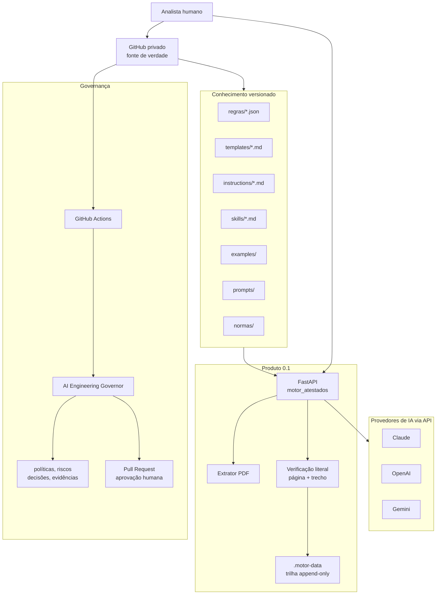
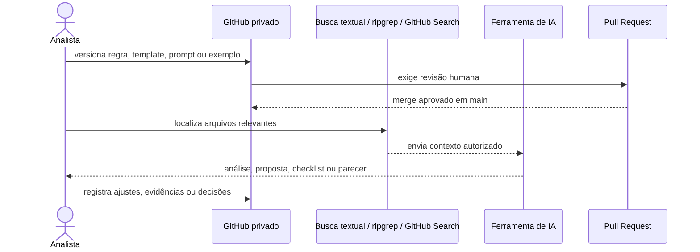
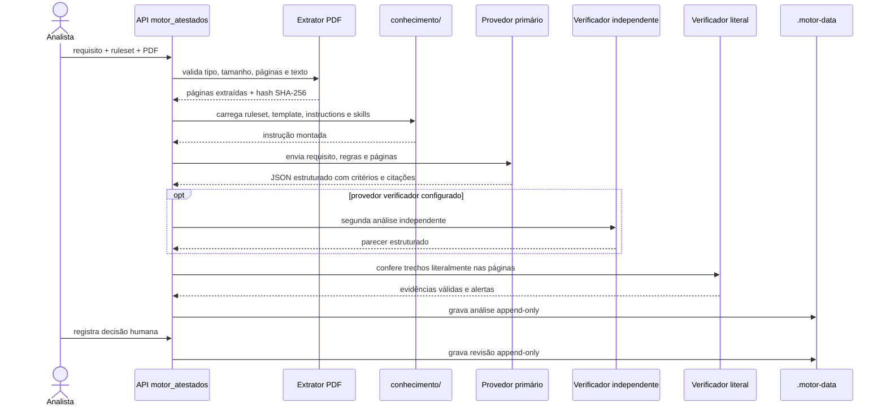

# Arquitetura do MVP

## 1. Decisão de arquitetura

O MVP deve ser tratado como um **Knowledge Repository governado para IA**, usando
o GitHub privado como fonte de verdade. Nesta fase, o repositório contém
conhecimento em Markdown e JSON, automações de validação, prompts especializados
e uma API local para o primeiro caso de produto: validação de atestados técnicos.

O projeto não depende de banco vetorial, servidor permanente ou RAG completo para
gerar valor inicial. A IA consulta arquivos versionados, recebe regras
estruturadas e devolve análises rastreáveis, sempre com revisão humana para
decisões materiais.



## 2. Componentes

| Componente | Papel no MVP | Estado |
| --- | --- | --- |
| `conhecimento/` | Fonte versionada de regras, templates, instructions, skills e exemplos aprovados | Implementado, ainda pequeno |
| `prompts/` | Biblioteca de prompts para análise documental de licitações | Implementado |
| `agente/` | Pipeline que executa prompts sobre casos e normas | Implementado, dependente de Claude |
| `motor_atestados/` | API FastAPI para validar requisito + atestado PDF contra ruleset | PoC executável `0.1` |
| `agente_governanca/` | Governador de engenharia com painel Claude, OpenAI e Gemini | Implementado |
| `.github/workflows/` | CI, análise documental e governança automática | Implementado |
| `.motor-data/` | Trilha local append-only para análises e revisões do motor | Piloto local |

## 3. Fluxo do Knowledge Repository



Regras operacionais:

- usar somente conteúdo aprovado para decisões materiais;
- preferir Markdown para conhecimento explicativo e JSON para regras executáveis;
- registrar origem, versão, status e responsável de cada artefato relevante;
- manter documentos reais fora do Git, salvo quando forem públicos e autorizados;
- registrar decisões por Pull Request, nunca por alteração automática direta.

## 4. Fluxo do motor de atestados



## 5. Governança e segurança

O projeto separa três planos:

| Plano | Responsabilidade | Controle principal |
| --- | --- | --- |
| Conhecimento | Regras, templates, prompts, normas e exemplos | Git, PR, status, versionamento |
| Produto | API, extração, evidência, resposta estruturada e revisão humana | Testes, logs sanitizados, API key |
| Governança | Avaliação de código, políticas, riscos e mudanças propostas | Governor, CI, CODEOWNERS, PR |

Controles já presentes:

- API protegida por `X-API-Key`;
- PDF processado em memória no piloto;
- limite de tamanho, páginas e contexto;
- hash SHA-256 do documento;
- saída validada por schema;
- citações conferidas literalmente;
- segundo provedor opcional para verificação independente;
- divergência, ambiguidade ou evidência inválida força revisão humana;
- logs sanitizados sem PDF, prompt integral, resposta integral ou secrets;
- workflows com Actions fixadas por SHA;
- governador em `pull_request_target` usa código confiável da branch base.

## 6. Estrutura-alvo do conhecimento

A estrutura atual já existe, mas deve crescer de forma controlada:

```text
conhecimento/
  README.md
  regras/
  templates/
  instructions/
  skills/
  examples/
  products/
  vendors/
  checklists/
  schemas/
```

Campos recomendados para front matter de arquivos Markdown:

```yaml
---
id: TEMPLATE-PROPOSAL-SOFTWARE-001
type: template
domain: software
status: approved
version: 1.0
owner: solutions-architecture
authority: template
classification: internal
---
```

Hierarquia de autoridade para conflitos:

```text
policy > rule > standard > template > knowledge > example
```

Se uma proposta antiga contradizer uma regra aprovada mais recente, a regra vence.

## 7. Evolução planejada

| Versão | Arquitetura | Objetivo |
| --- | --- | --- |
| V1 | GitHub privado + Markdown/JSON + busca textual + IA | MVP com custo operacional mínimo |
| V2 | V1 + PostgreSQL + pgvector local | Recuperação semântica e histórico estruturado |
| V3 | V2 + MCP Server + agentes especializados | Consulta padronizada por ferramentas |
| V4 | V3 + workflows, auditoria e avaliação automática | Operação corporativa governada |

PostgreSQL, pgvector, object storage, fila, RBAC, antimalware, OCR e observabilidade
centralizada são requisitos de produção, não pré-requisitos para o MVP local.

## 8. Limites do MVP

- não é parecer jurídico definitivo;
- não substitui decisão administrativa, técnica ou comercial;
- não deve receber documentos sigilosos sem aprovação de dados e segurança;
- não possui OCR para PDFs escaneados;
- não possui banco, fila, RBAC, object storage ou RAG vetorial;
- depende de chaves e cotas das APIs de IA para análise real;
- exige revisão humana antes de qualquer decisão material.
