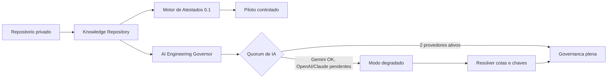

# Painel Operacional do Projeto

Snapshot: `2026-08-30`

Este painel resume o estado do projeto para decisao rapida. O detalhe tecnico
continua em [`roadmap-project.md`](roadmap-project.md), a arquitetura em
[`ARQUITETURA.md`](ARQUITETURA.md) e o piloto em
[`PLANO_PILOTO_10_USUARIOS.md`](PLANO_PILOTO_10_USUARIOS.md).

## Visao Executiva

| Frente | Estado | Proximo movimento |
| --- | --- | --- |
| MVP tecnico | Pronto para piloto controlado | Preparar massa sintetica e ambiente restrito |
| Governanca | Operando em modo degradado | Resolver cotas/chaves para voltar ao quorum `2/3` |
| Gemini | Integrado, mas limitado por cota free tier | Aguardar janela de quota ou ativar plano/cota |
| OpenAI | Chave existe, sem credito API | Ativar billing ou manter fora dos testes |
| Claude | Pendente | Adicionar `ANTHROPIC_API_KEY` quando disponivel |
| PRs abertas | Somente evidencias automatizadas | Revisar/mesclar ou fechar #31 e #32 |

## Placar

| Indicador | Valor |
| --- | ---: |
| Testes locais na `main` | `44 OK` |
| PRs tecnicos mesclados | `#20`, `#24` |
| PRs Dependabot mesclados | `#14`, `#15`, `#12` |
| Execucao Gemini-only bem-sucedida | `33335848855` |
| Execucao Gemini-only em `main` | `429 quota exceeded` |
| PRs abertas sem conflito | `#31`, `#32` |
| PRs abertas com conflito | `0` |

## Fluxo Atual

## Quadro Kanban

| Done | Doing | To do |
| --- | --- | --- |
| README, arquitetura e plano do piloto consolidados | Revisar PRs de evidencia `#31` e `#32` | Adicionar `ANTHROPIC_API_KEY` |
| Knowledge Repository inicial versionado | Operar Governor em modo degradado | Ativar credito OpenAI ou remover do teste temporario |
| Validacoes de seguranca do agente documental | Preparar massa sintetica de homologacao | Retornar quorum padrao `2/3` |
| Motor de Atestados `0.1` executavel | Organizar evidencias antigas do Governor | Provisionar ambiente piloto para ate 10 usuarios |
| Gemini corrigido e validado em branch | Documentar cada decisao por commit/PR | Implementar lifecycle D+7/D+9/D+10 |
| Timeout dos provedores do Governor em `main` | | Evoluir RBAC, OCR, banco, fila e observabilidade |

## Proxima Melhor Acao

1. Revisar os PRs de evidencia `#31` e `#32`.
2. Nao rodar novos testes Gemini-only em sequencia enquanto a cota free tier
   estiver esgotada.
3. Definir se OpenAI tera billing agora ou se ficara desabilitado na fase de
   piloto.
4. Adicionar Claude quando a chave estiver disponivel.
5. Rodar novamente o Governor com quorum `2/3` quando dois provedores estiverem
   operacionais.

## Trilhas

<strong>Done</strong>

- Documentacao principal consolidada no `README.md`, com arquitetura, execucao
  local, seguranca, limitacoes e operacao do piloto.
- Decisao de MVP registrada em `ARQUITETURA.md`: GitHub privado como fonte de
  verdade, Markdown/YAML/JSON versionados e RAG somente em fase posterior.
- Plano de piloto para aproximadamente 10 usuarios registrado em
  `PLANO_PILOTO_10_USUARIOS.md`.
- Knowledge Repository inicial criado em `conhecimento/`, com taxonomia para
  produtos, fornecedores, checklists, schemas, regras, templates, instructions e
  skills.
- Metadata de artefatos Markdown padronizada e validada por testes.
- Schema inicial de `caso.json` registrado em `schemas/caso.schema.json`.
- Validacoes de seguranca do agente documental implementadas para caso,
  documento, caminhos, tipo de arquivo, tamanho e limite de documentos.
- Motor de Validacao de Atestados mantido como PoC executavel `0.1`, com API,
  verificacao literal de evidencias, trilha append-only e revisao humana.
- GitHub Actions habilitado com permissao de leitura/escrita para workflows e
  criacao de Pull Requests pelo Actions.
- Secrets `GEMINI_API_KEY` e `OPENAI_API_KEY` adicionados ao repositorio.
- Falha de credito OpenAI evidenciada no workflow `33334021966`: retorno
  `429 insufficient_quota` / `credit_balance_exhausted`.
- Bug do cliente Gemini corrigido em `agente_governanca/provedores.py` e
  `motor_atestados/provedores.py`.
- Pull Request `#20 fix: manter cliente Gemini ativo` mesclado em `main` em
  2026-08-30.
- Workflow manual do AI Governor preparado para teste temporario somente com
  Gemini: `providers=gemini`, `min_providers=1`.
- Execucao remota somente com Gemini validada com sucesso no run
  `33334775581`.
- Pull Request de evidencia do run Gemini-only criado pelo Governor:
  `#21 governance: avaliacao do commit ef445c69b479`.
- Dependabot PRs `#15`, `#14` e `#12` mesclados em `main`.
- Timeout configuravel dos provedores do Governor implementado com
  `AI_GOVERNOR_PROVIDER_TIMEOUT_SECONDS` e padrao de 180 segundos.
- Pull Request `#24 fix: limitar timeout dos provedores do Governor` mesclado
  em `main` em 2026-08-30.
- Suite automatizada local validada com 44 testes aprovados.
- Execucao manual da branch `fix/governor-provider-timeout` com Gemini-only
  concluida com sucesso no run `33335848855`.
- Pull Request de evidencia `#25 governance: avaliacao do commit 494b48ec9086`
  mesclado em `main`.
- Pull Request `#27 docs: atualizar checklist apos merges` mesclado em `main`.
- Conflitos dos PRs abertos corrigidos; nao ha PR aberta marcada como `DIRTY`.

<strong>Doing</strong>

- Pull Requests de evidencia `#31` e `#32` abertas, ambas sem conflito textual.
- Validacao temporaria do AI Governor com apenas Gemini enquanto Claude e OpenAI
  nao estao disponiveis para quorum completo.
- Tratamento da cota Gemini free tier: o run `33336586153` retornou
  `429 quota exceeded` para `generate_content_free_tier_requests`.
- Organizacao das Pull Requests de evidencia abertas pelo Governor para reduzir
  ruido operacional.
- Preparacao da primeira homologacao do fluxo com massa sintetica e sem dados
  reais de licitacao.
- Documentacao operacional sendo mantida no repositorio para que as proximas
  decisoes fiquem rastreaveis por commit.

<strong>To do</strong>

- Adicionar `ANTHROPIC_API_KEY` quando a conta Claude API estiver pronta.
- Resolver cota/faturamento OpenAI ou manter OpenAI fora dos testes temporarios.
- Aguardar ou ampliar cota Gemini antes de repetir validacoes manuais em alta
  frequencia.
- Retornar ao quorum padrao `2/3` assim que pelo menos dois provedores
  independentes estiverem operacionais.
- Revisar, fechar ou fazer merge das PRs de evidencia antigas, mantendo somente
  evidencias uteis e atuais.
- Confirmar protecao de `main` com PR obrigatoria, aprovacao humana, conversas
  resolvidas e CODEOWNERS.
- Considerar migracao para GitHub Team se for necessario enforcement real de
  rulesets em repositorio privado.
- Preparar ambiente piloto unico para ate 10 usuarios, com VPN ou rede privada,
  TLS, reverse proxy, limite de upload e `MOTOR_API_KEY`.
- Configurar host do piloto com `GEMINI_API_KEY`, `.motor-data` em volume
  criptografado, logs sanitizados e processo Uvicorn gerenciado.
- Criar massa sintetica de PDFs e casos para homologacao juridica e tecnica.
- Executar smoke test do motor com PDF sintetico antes de qualquer dado real.
- Implementar rotina automatizada de lifecycle e expurgo conforme politica:
  alertas D+7/D+9 e remocao D+10.
- Planejar evolucao para autenticacao individual, RBAC, rate limiting,
  PostgreSQL, object storage, fila, OCR, antimalware/CDR e observabilidade.
- Definir baseline de custo, latencia, tokens, taxa de quorum e qualidade das
  citacoes com a massa de homologacao.

## Pendencias Do Usuario

| Pendencia | Impacto se continuar pendente |
| --- | --- |
| `ANTHROPIC_API_KEY` | Governor nao fecha quorum `2/3` sem outro provedor alem do Gemini |
| Credito OpenAI API | OpenAI segue retornando `insufficient_quota` |
| Cota Gemini | Testes manuais podem retornar `429 quota exceeded` |
| Local do piloto | Nao ha ambiente compartilhado para os 10 usuarios |
| Massa sintetica | Nao ha homologacao juridica/tecnica antes de dados reais |

## Evidencias Recentes

| Evidencia | Resultado | Observacao |
| --- | --- | --- |
| Run `33335848855` | Sucesso | Gemini-only validado na branch de timeout |
| Run `33336586153` | Falha controlada | Gemini retornou limite de cota free tier |
| PR `#31` | Aberto | Evidencia de push em `main` |
| PR `#32` | Aberto | Evidencia do Gemini-only em `main` com quota excedida |
