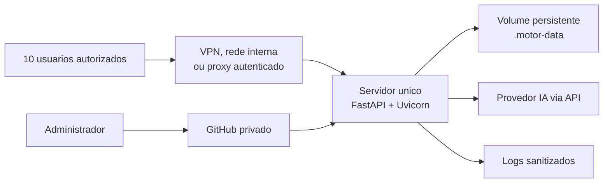

# Plano do Piloto Compartilhado para 10 Usuarios

## 1. Objetivo

Disponibilizar o MVP para um grupo restrito de aproximadamente 10 usuarios, sem
transformar a versao 0.1 em producao plena. O ambiente compartilhado deve servir
para homologacao de regras, medicao de qualidade, latencia, custo e operacao
humana.

## 2. Arquitetura recomendada

## 3. Requisitos minimos

| Item | Requisito |
| --- | --- |
| Host | 1 servidor Linux ou Windows Server |
| CPU | 4 vCPU |
| Memoria | 8 GB RAM |
| Disco | 20 a 50 GB criptografado |
| Entrada | HTTPS, VPN, rede interna ou proxy autenticado |
| Processo | Uvicorn gerenciado como servico |
| Persistencia | `.motor-data/` em volume persistente |
| Segredo da API | `MOTOR_API_KEY` fora do Git |
| Provedor IA | ao menos uma chave API homologada |
| Backup | controlado e compativel com retencao de 10 dias |

## 4. Controles obrigatorios antes do uso

- repositorio GitHub privado;
- `main` protegida por Pull Request e aprovacao humana;
- GitHub Actions habilitado;
- secrets dos provedores cadastrados;
- acesso restrito ao grupo piloto;
- dados reais somente com autorizacao formal;
- logs sem PDF, requisito, prompt integral, resposta integral ou secrets;
- revisao humana obrigatoria para toda decisao material;
- procedimento manual de expurgo enquanto o lifecycle automatico nao existir.

## 5. Sequencia de implantacao

1. Validar testes locais e workflows no GitHub.
2. Homologar pelo menos um ruleset com especialistas.
3. Configurar servidor unico do piloto.
4. Definir `MOTOR_API_KEY`, provedor IA e modelos autorizados.
5. Subir API em `127.0.0.1` atras de proxy/VPN.
6. Executar smoke test com PDF sintetico.
7. Liberar primeiro grupo de usuarios.
8. Registrar custo, latencia, falhas e decisoes humanas.
9. Revisar resultados antes de ampliar uso.

## 6. Fora do escopo do piloto

- alta disponibilidade;
- multiplas replicas;
- Kubernetes;
- banco vetorial;
- RAG completo;
- autenticacao individual dentro da API;
- isolamento forte por orgao ou cliente;
- documentos sigilosos sem aprovacao de dados e seguranca.

## 7. Pendencias externas

Estas atividades nao podem ser concluidas apenas por alteracao no repositorio:

- cadastrar `ANTHROPIC_API_KEY`, `OPENAI_API_KEY` e `GEMINI_API_KEY` no GitHub;
- habilitar faturamento e cotas das APIs;
- configurar branch protection/ruleset em `main`;
- permitir que GitHub Actions crie Pull Requests;
- provisionar servidor, DNS, TLS, VPN/proxy e armazenamento criptografado;
- aprovar classificacao de dados, base de uso e termos dos provedores.

