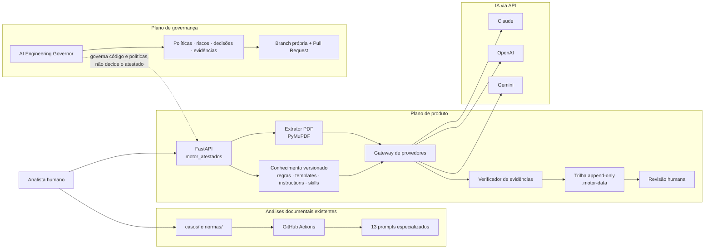
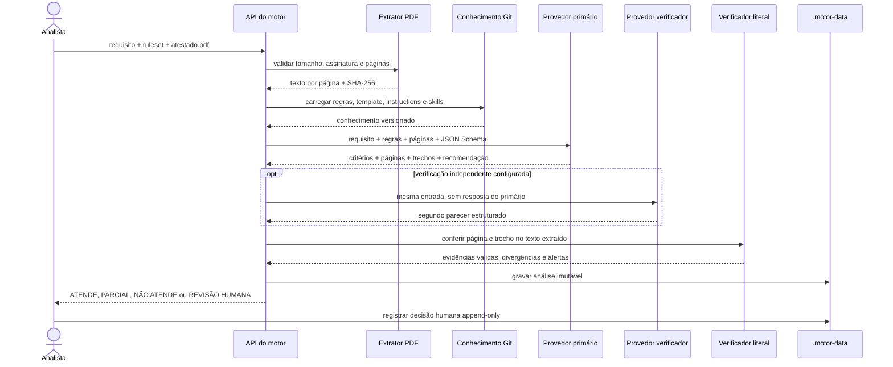
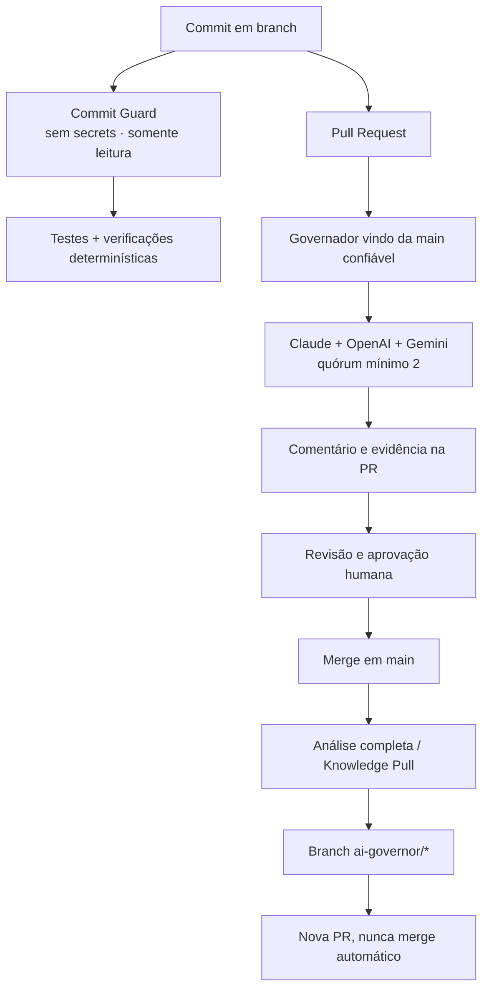
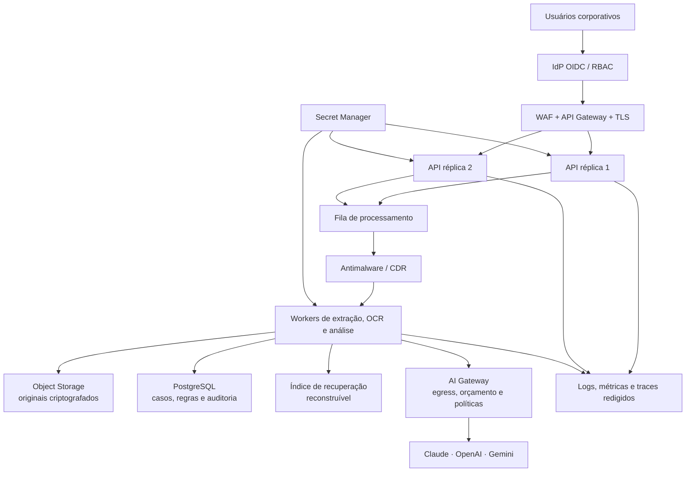

# Plataforma Governada de Análise de Licitações

Plataforma de IA para análise auditável de contratações públicas brasileiras,
com regras de negócio versionadas, evidências verificáveis e decisões materiais
sujeitas a revisão humana.

O repositório reúne três componentes independentes:

| Componente | Responsabilidade | Estado |
| --- | --- | --- |
| Motor de Validação de Atestados | Compara requisito e atestado, identifica evidências e recomenda classificação | PoC executável `0.1` |
| Agente de Licitações | Executa os 13 prompts documentais sobre casos e normas | Pipeline existente |
| AI Engineering Governor | Avalia código, arquitetura, segurança, IA e políticas | Painel Claude, OpenAI e Gemini |

Documentação complementar:

- [Manual geral](MANUAL_DE_USO.md)
- [Manual do Motor de Atestados](MANUAL_MOTOR_ATESTADOS.md)
- [Massa necessária para homologação](MASSA_TESTES_PRODUTO.md)
- [Insumos que devem ser solicitados aos usuários](INSUMOS_USUARIOS_PRODUTO.md)
- [Política de retenção e expurgo](governanca/politicas/RETENCAO_DADOS.md)
- [Roadmap técnico](roadmap-project.md)

## Arquitetura atual

### Visão dos componentes



O plano de produto processa documentos de licitação. O plano de governança
avalia o software e propõe alterações por Pull Request. O governador não acessa
o conteúdo de `casos/` ou `normas/` durante sua análise semântica e não decide
se um atestado atende ao requisito.

### Fluxo de uma validação de atestado



Controles atuais do motor:

- PDF processado em memória, sem gravação do original;
- limite de 20 MB, 300 páginas e 300 mil caracteres de contexto;
- hash SHA-256 do documento;
- resposta validada por JSON Schema;
- citação conferida literalmente na página extraída;
- segundo provedor opcional e independente;
- divergência, ambiguidade ou evidência inválida força revisão humana;
- API protegida por `X-API-Key`;
- análises e revisões gravadas sem sobrescrever o registro anterior.

### Governança de commits e Pull Requests



## Estrutura do repositório

| Caminho | Conteúdo |
| --- | --- |
| `motor_atestados/` | API, domínio, extração, provedores e trilha de evidências |
| `conhecimento/` | Regras, templates, instructions, skills e exemplos permitidos |
| `evals/` | Schema e orientação para a massa de avaliação |
| `agente/` | Pipeline dos 13 prompts documentais existentes |
| `agente_governanca/` | AI Engineering Governor |
| `casos/` | Documentos e relatórios por processo |
| `normas/` | Corpus jurídico oficial |
| `prompts/` | Prompts especializados e índice de gatilhos |
| `governanca/` | Políticas, riscos, decisões e evidências do governador |
| `.github/workflows/` | CI, análise documental e governança automatizada |

## Requisitos de infraestrutura

### Execução local do motor 0.1

Este é o ambiente mínimo para executar exatamente o código disponível hoje:

| Recurso | Mínimo | Recomendado para desenvolvimento |
| --- | --- | --- |
| CPU | 2 vCPU x64 | 4 vCPU x64 |
| Memória | 4 GB | 8 GB |
| Disco livre | 5 GB + evidências | 20 GB + política de limpeza |
| Sistema operacional | Windows 11, Linux x64 ou macOS | Linux x64 ou Windows 11 |
| Runtime | Python 3.12 | Python 3.12 em ambiente virtual |
| Rede de saída | HTTPS 443 para o provedor escolhido | Saída restrita aos endpoints autorizados |
| Porta local | TCP 8000 em `127.0.0.1` | Reverse proxy somente no piloto compartilhado |
| Persistência | Diretório local `.motor-data/` | Volume criptografado e com backup controlado |

O processamento carrega o upload e o texto extraído em memória. A quantidade de
requisições simultâneas deve permanecer limitada no piloto; o consumo real de
RAM, tokens, latência e custo precisa ser medido com a massa de homologação.

O conteúdo temporário controlado pela solução possui prazo máximo de 10 dias
após a conclusão da análise. A regra, seu escopo e a lacuna de automação da
versão atual estão na
[`Política de Retenção e Expurgo`](governanca/politicas/RETENCAO_DADOS.md). A
retenção feita por provedores externos segue os termos contratualmente aceitos e
não é contabilizada como armazenamento da infraestrutura deste produto.

Dependências:

```powershell
python -m venv .venv
.\.venv\Scripts\Activate.ps1
python -m pip install --upgrade pip
python -m pip install -r requirements-product.txt
```

Variáveis necessárias para o motor:

| Variável | Obrigatória | Finalidade |
| --- | --- | --- |
| `MOTOR_API_KEY` | Sim | Protege os endpoints `/v1/*` |
| `MOTOR_DATA_DIR` | Não | Diretório da trilha local; padrão `.motor-data` |
| `MOTOR_ENVIRONMENT` | Não | Identifica o ambiente nos logs; padrão `local` |
| `MOTOR_LOG_LEVEL` | Não | Nível mínimo dos eventos; padrão `INFO` |
| `MOTOR_LOG_FILE` | Não | Arquivo JSONL; padrão `.motor-data/logs/motor.jsonl` |
| `MOTOR_LOG_RETENTION_DAYS` | Não | Quantidade de arquivos diários rotacionados; padrão `10` |
| `ATESTADOS_PROVIDER` | Não | `anthropic`, `openai` ou `gemini`; padrão automático |
| `ANTHROPIC_API_KEY` | Condicional | Necessária quando Claude for utilizado |
| `OPENAI_API_KEY` | Condicional | Necessária quando OpenAI for utilizada |
| `GEMINI_API_KEY` | Condicional | Necessária quando Gemini for utilizado |
| `ATESTADOS_ANTHROPIC_MODEL` | Não | Modelo Claude homologado pelo time |
| `ATESTADOS_OPENAI_MODEL` | Não | Modelo OpenAI homologado pelo time |
| `ATESTADOS_GEMINI_MODEL` | Não | Modelo Gemini homologado pelo time |

Ao menos uma chave de provedor é necessária para uma análise real. Assinaturas
de ChatGPT, Claude ou Gemini para usuário final não fornecem automaticamente
crédito nem chave para as respectivas APIs.

### GitHub Actions e governador

O governador não exige servidor permanente. Os workflows usam runners hospedados
do GitHub ou runners próprios com:

- Python 3.12;
- acesso HTTPS ao GitHub e aos provedores configurados;
- repositório privado;
- GitHub Actions habilitado;
- secrets `ANTHROPIC_API_KEY`, `OPENAI_API_KEY` e `GEMINI_API_KEY`;
- permissão do Actions para criar branches e Pull Requests;
- `main` protegida por PR, aprovação humana e CODEOWNERS;
- sem bypass de ruleset para o token do agente.

Para runners próprios, adote no mínimo 2 vCPU, 4 GB de RAM, 10 GB livres,
isolamento entre jobs e descarte do workspace após cada execução. Não reutilize
runner com secrets para executar código de Pull Request não aprovado.

### Piloto compartilhado com o time

O código atual pode ser disponibilizado para um grupo restrito em **uma única
instância**, pois a persistência local ainda não suporta múltiplas réplicas:

| Camada | Requisito recomendado |
| --- | --- |
| Host da API | 4 vCPU, 8 GB RAM, 20 GB de disco criptografado |
| Processo | Uvicorn gerenciado por serviço do sistema, uma instância |
| Entrada | Reverse proxy com TLS, limite de 20 MB e rede privada/VPN |
| Autenticação | `MOTOR_API_KEY` em Secret Manager; acesso apenas ao grupo piloto |
| Saída | HTTPS somente para o provedor homologado |
| Logs | JSONL em stdout e arquivo rotativo, sem PDF, requisito, prompt, resposta ou secrets |
| Backup | Backup criptografado de `.motor-data/`, sem ultrapassar 10 dias para conteúdo |

Esse ambiente é apenas piloto. A chave técnica compartilhada não substitui
identidade individual, autorização por órgão ou segregação entre casos.

### Arquitetura-alvo para produção

Os componentes abaixo são requisitos futuros; ainda não estão implementados na
versão `0.1`.



Baseline inicial para dimensionamento, sujeito a teste de carga:

- duas réplicas de API com 2 vCPU e 4 GB cada;
- workers separados com 2–4 vCPU e 4–8 GB conforme OCR e concorrência;
- PostgreSQL gerenciado com 2–4 vCPU, 8 GB, criptografia, backup e alta disponibilidade;
- object storage privado com versionamento, retenção e lifecycle;
- fila gerenciada com dead-letter queue e idempotência;
- Secret Manager, identidade gerenciada e rotação;
- API Gateway/WAF com TLS, rate limiting e limites de upload;
- inspeção antimalware e CDR para PDFs, conforme a classificação de risco;
- observabilidade sem conteúdo sensível;
- ambientes separados de desenvolvimento, homologação e produção;
- região, residência e retenção aprovadas para cada provedor de IA.

Object storage, banco, índices, caches e backups devem permitir exclusão por
análise. A confirmação de exportação permite expurgo antecipado; em qualquer
caso, o conteúdo integral deve ser removido em até 10 dias após a conclusão.

O dimensionamento final depende de páginas por documento, qualidade do OCR,
concorrência, quantidade de critérios, número de provedores e SLO. A massa de
200 casos deve produzir o primeiro baseline de capacidade e custo.

## Executar o motor localmente

Configure `MOTOR_API_KEY` e ao menos uma chave de provedor, depois execute:

```powershell
python -m motor_atestados
```

Endpoints:

- `GET /health` — estado, provedores configurados e rulesets;
- `GET /v1/rulesets` — conjuntos de regras disponíveis;
- `POST /v1/analyses` — nova análise com upload multipart;
- `GET /v1/analyses/{id}` — análise e revisões;
- `POST /v1/analyses/{id}/reviews` — decisão humana append-only;
- `/docs` — documentação OpenAPI interativa.

Por padrão, a aplicação escuta em `http://127.0.0.1:8000` e não fica exposta à
rede. Consulte o [manual do motor](MANUAL_MOTOR_ATESTADOS.md) para exemplos de
requisição.

## Executar o agente documental existente

```bash
pip install -r requirements.txt
python -m agente.executar --caso EXEMPLO-001 --prompt revisao-etp
```

O workflow `analise.yml` detecta alterações em `casos/**`, seleciona os prompts
por `entrada_glob`, chama Claude e propõe os relatórios em Pull Request. O corpus
de `normas/` é sincronizado por checksum e pode usar cache do provedor.

## Executar o governador

```bash
pip install -r requirements-governance.txt
python -m agente_governanca --mode deterministic
python -m agente_governanca --require-ai
python -m agente_governanca --knowledge-pull --apply-proposals
```

O quórum padrão é de dois provedores independentes entre Claude, OpenAI e Gemini.
Nenhuma alteração é aplicada diretamente em `main`; evidências e patches são
propostos em branch própria e dependem de Pull Request e aprovação humana.

## Segurança e dados

- mantenha o repositório privado;
- nunca envie `.env`, chaves ou documentos reais ao Git;
- use somente dados sintéticos ou formalmente autorizados durante o piloto;
- classifique dados, finalidade, base legal, acesso, retenção e descarte;
- avalie termos de treinamento, retenção, residência e subprocessadores de cada provedor;
- trate requisito, PDF e conteúdo recuperado como dados não confiáveis;
- confira toda página e trecho antes da decisão humana;
- não exponha a versão `0.1` diretamente à internet.

## Limitações atuais

- sem OCR para PDFs escaneados;
- sem PostgreSQL, object storage, fila ou RAG vetorial;
- sem autenticação individual, RBAC, rate limiting e isolamento por órgão;
- persistência local sem idempotência, alta disponibilidade ou backup automático;
- validação de upload sem antimalware ou CDR nesta etapa;
- agente documental ainda dependente somente de Claude;
- qualidade jurídica pendente de benchmark com a massa homologada;
- saída de IA não substitui parecer jurídico ou decisão administrativa formal;
- prompt de podcast educativo permanece em fluxo manual no NotebookLM.

## Referências operacionais

- [FastAPI: conceitos de deployment](https://fastapi.tiangolo.com/deployment/concepts/)
- [FastAPI em containers](https://fastapi.tiangolo.com/deployment/docker/)
- [GitHub: escolha e capacidade dos runners](https://docs.github.com/en/actions/how-tos/write-workflows/choose-where-workflows-run/choose-the-runner-for-a-job)
- [OWASP: segurança em upload de arquivos](https://cheatsheetseries.owasp.org/cheatsheets/File_Upload_Cheat_Sheet.html)
